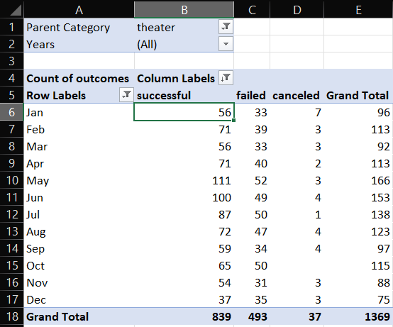
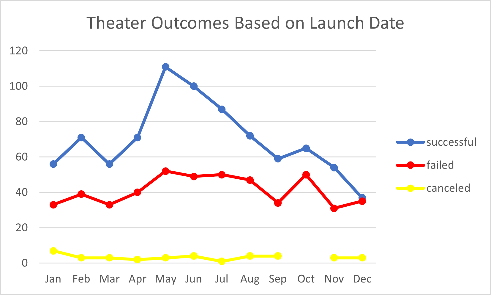
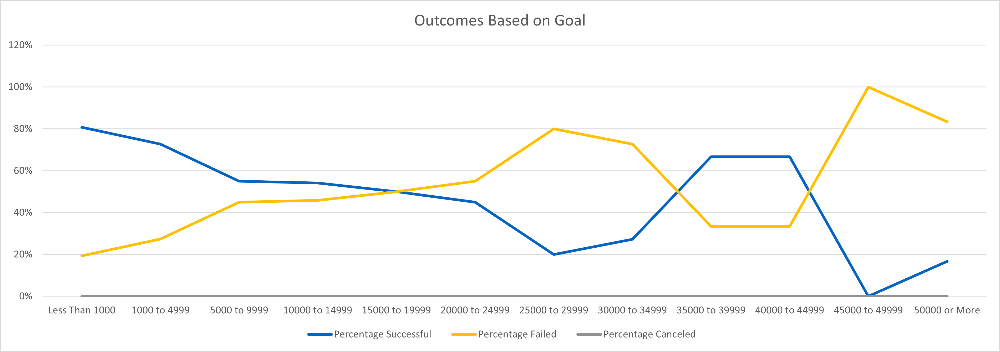

# An Analysis of Kickstarter Campaigns
Performing analysis on Kistarter data to uncover trends

# Analysis
  Within this project an analysis of Kickstarter projects comared to Launch dates and Goals. In order to compare launch dates a pivot table was created and filtered to show theater releases by month
  
  
  
  In order to compare against goals it was neccessesary to use a few functions. 
  
  `=COUNTIFS(Kickstarter!D:D,">=1000",Kickstarter!D:D,"<=4999",  Kickstarter!F:F, "=Successful",Kickstarter!R:R,"=Plays")`
  
  CountIfs was used to count the each row which fit the requirements, in this case this function counts each row which is greater than 1000 and less than 5000, filtered for plays which are successful only. 
  
  `=SUM(B2:D2)` 
  
  Sum was used to add up the selected cells, this function will add the range of cells selected in this case B2 + C2 + D2. 
# Challenges
  Because of the amount of data it was easy to use `=B2+C2+D2` instead of `=SUM(B2:D2)` but using the sum function is simpler and in the case for a larger amount of data is prefered to limit human error.

# Results
  
  
  Projects launched in May, Jun, and July have the most success.
  It would be best to avoid launching a project passed Octorber, these month have a lower chance of success and in Octobers case a spike in failures.  
  
  
  Project with a goal in the range of 0 to 15000 and 35000 to 45000, have the most success. 

# Recommendation
  One other possible chart and table which could privide insights would be a comparison between non staff picks success to success of staff picks. 
